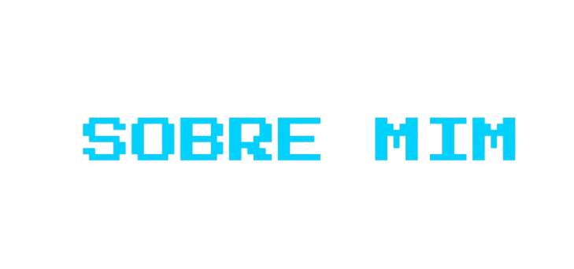

    

    

 

    

 

    
👋 Olá! Meu nome é Víctor Santucci, estudante de Engenharia de Software na UNIFACEF, e sou apaixonado por tecnologia e programação! Como desenvolvedor Full Stack, me dedico à construção de soluções eficientes. Adoro colaborar em projetos que possam sempre me desafiar, em busca de aprimorar minhas habilidades e também expandir meu conhecimento.

    
✨ Além disso, tenho experiência com uma variedade de tecnologias modernas do mercado, incluindo JavaScript, Node.js, TypeScript e PostgreSQL. Estou constantemente trabalhando para minha evolução como profissional, aprendendo e revisando estudos com novas ferramentas e frameworks para criar aplicações cada vez melhores.

  

---

    

    <h3>🚀 Minhas habilidades incluem:</h3>

    <ul>
        <li>Front-end: <strong>React, React Native, Vite</strong> 🎨</li>
        <li>Back-end: <strong>JavaScript, Node.js, TypeScript</strong> ⚙️</li>
        <li>APIs: <strong>Express, Fastify</strong> 🌐</li>
        <li>ORMs: <strong>Sequelize, TypeORM, Prisma</strong> 📊</li>
        <li>Banco de Dados: <strong>PostgreSQL, MySQL, MongoDB</strong> 🗄️</li>
        <li>Ferramentas: <strong>Docker, Postman</strong> 🛠️</li>
        <li>Testes: <strong>Jest</strong> 🧪</li>
        <li>Versionamento de Código: <strong>Git, GitHub, GitLab</strong> 🧑‍💻</li>
    </ul>

 

---
  

  

    

    

    

---
 

   

    
    
    
    
    
    
    
    
    
    
    
    

 

---

 

   

    
    
    

 

---
